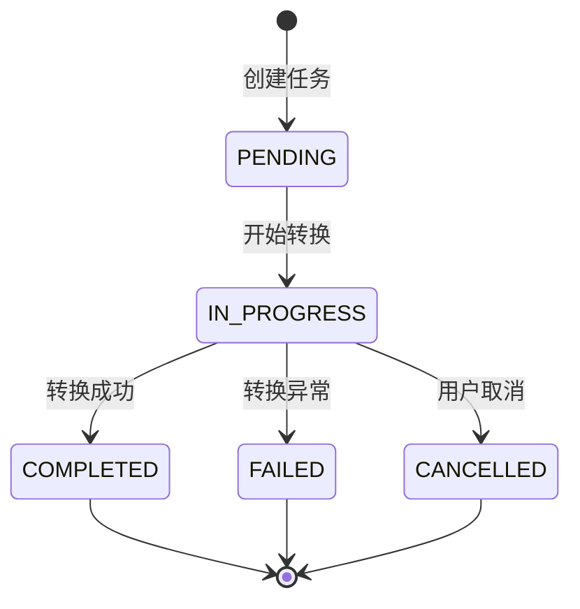

# 数据模型设计

**项目**: WebP图片转换器
**版本**: 1.0.0
**创建日期**: 2025-10-21
**相关文档**: [spec.md](spec.md), [plan.md](plan.md)

---

## 概述

本文档定义WebP图片转换器的核心数据实体及其属性、关系和状态转换。所有实体均为内存对象,无需数据库持久化(符合plan.md的"本地文件系统"存储策略)。

---

## 核心实体

### 1. ImageFile (图片文件实体)

**用途**: 表示待转换或已转换的图片文件,封装文件元信息和验证逻辑。

**属性**:

| 属性名 | 类型 | 必填 | 说明 | 验证规则 |
|-------|------|------|------|---------|
| `file_path` | `Path` | ✅ | 文件绝对路径 | 必须存在且可读 |
| `file_name` | `str` | ✅ | 文件名(含扩展名) | 自动从`file_path`提取 |
| `format` | `str` | ✅ | 图片格式(大写) | JPEG/PNG/GIF/BMP/WEBP之一 |
| `width` | `int` | ✅ | 图片宽度(像素) | > 0 |
| `height` | `int` | ✅ | 图片高度(像素) | > 0 |
| `file_size` | `int` | ✅ | 文件大小(字节) | ≥ 0 |
| `file_size_mb` | `float` | - | 文件大小(MB) | 计算属性: `file_size / (1024 * 1024)` |
| `exceeds_soft_limit` | `bool` | - | 是否超出软性限制 | 计算属性: `file_size_mb > 200 or width > 8000 or height > 8000` |
| `metadata` | `ImageMetadata` | - | 图片元数据(可选) | 见`ImageMetadata`实体 |
| `is_valid` | `bool` | - | 文件是否有效 | 计算属性: 格式支持且可读取 |

**方法**:

```python
@classmethod
def from_path(cls, file_path: str | Path) -> ImageFile:
    """从文件路径创建ImageFile实例,自动提取元信息"""

def validate(self) -> tuple[bool, str]:
    """验证文件有效性,返回(is_valid, error_message)"""

def get_display_info(self) -> dict:
    """返回适合在UI显示的信息字典"""
```

**状态不变式**:
- `file_path`必须指向存在的文件
- `format`必须在支持的格式列表中
- `width`和`height`必须大于0

**边界情况处理**:
- 文件不存在 → `validate()`返回`(False, "图片文件损坏或无法访问,请检查文件")`
- 文件格式不支持 → `validate()`返回`(False, "不支持的文件格式,请选择图片文件(JPEG, PNG, GIF等)")`
- 超出软性限制 → `exceeds_soft_limit=True`,由GUI显示警告对话框

---

### 2. ImageMetadata (图片元数据实体)

**用途**: 封装EXIF/IPTC/XMP元数据,用于转换时保留原始信息。

**属性**:

| 属性名 | 类型 | 必填 | 说明 |
|-------|------|------|------|
| `exif` | `bytes` \| `None` | - | EXIF数据(原始字节) |
| `xmp` | `bytes` \| `None` | - | XMP数据(原始字节) |
| `icc_profile` | `bytes` \| `None` | - | ICC色彩配置文件 |
| `has_metadata` | `bool` | - | 是否包含任何元数据(计算属性) |

**方法**:

```python
@classmethod
def from_pil_image(cls, pil_image: Image.Image) -> ImageMetadata:
    """从Pillow Image对象提取元数据"""

def to_save_params(self) -> dict:
    """返回用于Pillow保存时的参数字典"""
    # 示例: {'exif': self.exif, 'xmp': self.xmp, 'icc_profile': self.icc_profile}
```

**说明**:
- IPTC元数据不直接支持(WebP规范限制),需转换为XMP格式(留待未来扩展)
- 元数据以原始字节形式保存,避免解析和重新编码导致的信息丢失

---

### 3. QualityPreset (质量预设实体)

**用途**: 定义三种预设的压缩质量选项,对应`spec.md`的FR-004需求。

**属性**:

| 属性名 | 类型 | 必填 | 说明 | 有效值 |
|-------|------|------|------|-------|
| `name` | `str` | ✅ | 预设名称(中文) | "高压缩" / "普通" / "低压缩" |
| `quality` | `int` | ✅ | WebP质量参数 | 0-100之间的整数 |
| `description` | `str` | ✅ | 适用场景描述 | 中文说明文本 |

**预定义常量**:

```python
class QualityPreset(Enum):
    HIGH_COMPRESSION = ("高压缩", 60, "适用于对文件大小敏感的场景")
    NORMAL = ("普通", 80, "平衡质量和大小")
    LOW_COMPRESSION = ("低压缩", 95, "优先保证质量")

    def __init__(self, name: str, quality: int, description: str):
        self.display_name = name
        self.quality_value = quality
        self.desc = description
```

**验证规则**:
- `quality`必须在[0, 100]范围内
- 三个预设的`quality`值应满足: 高压缩 < 普通 < 低压缩

---

### 4. ConversionTask (转换任务实体)

**用途**: 表示单张图片的转换任务,跟踪转换状态和结果。

**属性**:

| 属性名 | 类型 | 必填 | 说明 | 默认值 |
|-------|------|------|------|-------|
| `task_id` | `str` | ✅ | 任务唯一标识符 | 自动生成UUID |
| `input_file` | `ImageFile` | ✅ | 输入图片文件对象 | - |
| `output_path` | `Path` | ✅ | 输出WebP文件路径 | - |
| `quality` | `int` | ✅ | 转换质量参数(0-100) | - |
| `preserve_metadata` | `bool` | ✅ | 是否保留元数据 | `True` |
| `status` | `TaskStatus` | ✅ | 任务状态 | `TaskStatus.PENDING` |
| `output_file_size` | `int` \| `None` | - | 输出文件大小(字节) | 完成后填充 |
| `compression_ratio` | `float` \| `None` | - | 压缩比(百分比) | 完成后计算 |
| `duration_seconds` | `float` \| `None` | - | 转换耗时(秒) | 完成后填充 |
| `error_message` | `str` \| `None` | - | 错误信息(失败时) | 失败时填充 |
| `created_at` | `datetime` | ✅ | 任务创建时间 | 自动设置 |
| `started_at` | `datetime` \| `None` | - | 开始转换时间 | 开始时设置 |
| `finished_at` | `datetime` \| `None` | - | 完成时间 | 完成/失败/取消时设置 |

**TaskStatus枚举**:

```python
class TaskStatus(Enum):
    PENDING = "待转换"       # 任务已创建,等待执行
    IN_PROGRESS = "转换中"   # 正在执行转换
    COMPLETED = "已完成"     # 转换成功
    FAILED = "失败"         # 转换失败(有错误信息)
    CANCELLED = "已取消"    # 用户主动取消
```

**状态转换规则**:



**不变式**:
- `PENDING` → 可转换为`IN_PROGRESS`或`CANCELLED`
- `IN_PROGRESS` → 可转换为`COMPLETED`/`FAILED`/`CANCELLED`
- `COMPLETED`/`FAILED`/`CANCELLED` → 终态,不可再转换

**方法**:

```python
def start(self) -> None:
    """标记任务开始,设置started_at时间"""

def complete(self, output_size: int, duration: float) -> None:
    """标记任务完成,计算压缩比和耗时"""

def fail(self, error: str) -> None:
    """标记任务失败,记录错误信息"""

def cancel(self) -> None:
    """标记任务取消"""

def get_result_summary(self) -> dict:
    """返回任务结果摘要(用于UI显示)"""
```

---

### 5. BatchConversionJob (批量转换作业实体)

**用途**: 管理多张图片的批量转换,跟踪整体进度和每个子任务状态。

**属性**:

| 属性名 | 类型 | 必填 | 说明 |
|-------|------|------|------|
| `job_id` | `str` | ✅ | 作业唯一标识符(UUID) |
| `tasks` | `list[ConversionTask]` | ✅ | 子任务列表 |
| `quality` | `int` | ✅ | 统一的质量参数 |
| `total_count` | `int` | - | 总任务数(计算属性) |
| `completed_count` | `int` | - | 已完成数(计算属性) |
| `failed_count` | `int` | - | 失败数(计算属性) |
| `cancelled_count` | `int` | - | 已取消数(计算属性) |
| `progress_percentage` | `float` | - | 进度百分比(计算属性: (completed+failed+cancelled)/total*100) |
| `is_complete` | `bool` | - | 作业是否完成(计算属性: 所有任务均处于终态) |
| `created_at` | `datetime` | ✅ | 作业创建时间 |

**方法**:

```python
def add_task(self, task: ConversionTask) -> None:
    """添加子任务到作业"""

def get_pending_tasks(self) -> list[ConversionTask]:
    """获取所有待处理的任务"""

def get_summary(self) -> dict:
    """返回作业摘要(总数/完成数/失败数/进度百分比)"""

def cancel_pending_tasks(self) -> int:
    """取消所有未开始的任务,返回取消数量"""
```

---

## 实体关系图

```
┌─────────────────┐
│  ImageFile      │
│  ─────────────  │
│  + file_path    │
│  + format       │
│  + width/height │
│  + file_size    │
│  + metadata ────┼───── ImageMetadata
└────────┬────────┘           (1对1,可选)
         │
         │ 1:1
         │
┌────────▼────────────┐
│  ConversionTask     │
│  ─────────────────  │
│  + task_id          │
│  + input_file       │◄────── 引用ImageFile
│  + output_path      │
│  + quality          │
│  + status           │
│  + output_file_size │
└────────┬────────────┘
         │
         │ N:1
         │
┌────────▼────────────────┐
│  BatchConversionJob     │
│  ──────────────────────  │
│  + job_id               │
│  + tasks: List[Task]    │◄─── 包含多个ConversionTask
│  + total_count          │
│  + completed_count      │
└─────────────────────────┘

┌──────────────────┐
│  QualityPreset   │  (独立实体,枚举类型)
│  ──────────────  │
│  + HIGH_COMPRESS │
│  + NORMAL        │
│  + LOW_COMPRESS  │
└──────────────────┘
```

---

## 验证规则总结

### ImageFile验证

| 验证项 | 规则 | 错误消息(中文) |
|-------|------|--------------|
| 文件存在性 | `file_path.exists()` | "图片文件损坏或无法访问,请检查文件" |
| 格式支持 | `format in ['JPEG', 'PNG', 'GIF', 'BMP', 'WEBP']` | "不支持的文件格式,请选择图片文件(JPEG, PNG, GIF等)" |
| 尺寸有效性 | `width > 0 and height > 0` | "图片尺寸无效" |
| 软性限制 | `file_size_mb <= 200 and width <= 8000 and height <= 8000` | (警告而非错误)"图片文件较大(XXX MB)或尺寸较大(WIDTHxHEIGHT),转换可能需要较长时间且消耗较多内存,是否继续?" |

### ConversionTask验证

| 验证项 | 规则 | 错误消息(中文) |
|-------|------|--------------|
| 质量参数范围 | `0 <= quality <= 100` | "质量参数必须在0-100之间" |
| 输出路径可写 | `output_path.parent.exists()` | "输出目录不存在" |
| 磁盘空间 | 预估所需空间 < 可用空间 | "磁盘空间不足,无法保存转换后的文件" |

---

## 状态管理策略

### 单张转换状态管理

```python
# 创建任务
task = ConversionTask(
    input_file=image_file,
    output_path=output_path,
    quality=80
)  # status=PENDING

# 开始转换
task.start()  # status=IN_PROGRESS, started_at=now

# 成功完成
task.complete(output_size=1234567, duration=2.5)
# status=COMPLETED, finished_at=now, compression_ratio计算

# 或失败
task.fail("内存不足,无法处理此图片")
# status=FAILED, error_message设置

# 或取消
task.cancel()
# status=CANCELLED, finished_at=now
```

### 批量转换状态管理

```python
# 创建批量作业
job = BatchConversionJob(quality=80)
for file in file_list:
    task = ConversionTask(input_file=file, ...)
    job.add_task(task)

# 执行转换(伪代码)
for task in job.get_pending_tasks():
    if stop_event.is_set():  # 检查取消标志
        job.cancel_pending_tasks()  # 取消剩余任务
        break

    task.start()
    try:
        # 执行转换...
        task.complete(...)
    except Exception as e:
        task.fail(str(e))

    # 更新进度: job.progress_percentage自动计算
```

---

## 文件名冲突处理

**需求**: FR-013要求自动重命名避免覆盖已有文件。

**实现策略**:

```python
def resolve_output_path(base_path: Path) -> Path:
    """
    解决文件名冲突,返回唯一路径
    示例: output.webp → output_1.webp → output_2.webp
    """
    if not base_path.exists():
        return base_path

    stem = base_path.stem
    suffix = base_path.suffix
    parent = base_path.parent
    counter = 1

    while True:
        new_path = parent / f"{stem}_{counter}{suffix}"
        if not new_path.exists():
            return new_path
        counter += 1
```

**集成点**: 在创建`ConversionTask`时调用`resolve_output_path`确保`output_path`唯一。

---

## 边界情况和错误处理

### 文件系统错误

| 场景 | 检测时机 | 处理策略 |
|------|---------|---------|
| 磁盘空间不足 | 转换前预检查 | 返回错误,禁止转换 |
| 输出目录无写权限 | 转换前验证 | 返回错误,提示权限问题 |
| 文件名包含非法字符 | 创建任务时 | 自动清理或提示用户 |

### 内存限制

| 场景 | 检测时机 | 处理策略 |
|------|---------|---------|
| 图片解码内存不足 | 转换过程中捕获`MemoryError` | 任务标记为`FAILED`,错误消息:"内存不足,无法处理此图片" |

### 并发控制

| 场景 | 限制 | 实现 |
|------|-----|------|
| 批量转换并发数 | 最多3个并发 | `ThreadPoolExecutor(max_workers=3)` |
| 取消操作响应 | <1秒 | 周期性检查`threading.Event` |

---

## 数据模型与规格需求映射

| 规格需求 | 对应实体/属性 |
|---------|-------------|
| FR-002: 支持JPEG/PNG/GIF/BMP | `ImageFile.format`验证 |
| FR-004: 三种预设质量 | `QualityPreset`枚举 |
| FR-005: 自定义质量(0-100) | `ConversionTask.quality`验证 |
| FR-006: 显示原始图片信息 | `ImageFile.get_display_info()` |
| FR-007: 显示输出文件信息 | `ConversionTask.get_result_summary()` |
| FR-013: 文件名冲突自动重命名 | `resolve_output_path()`函数 |
| FR-014: 保留EXIF/IPTC/XMP | `ImageMetadata`实体 |
| FR-015: 支持取消操作 | `TaskStatus.CANCELLED`状态 |
| FR-016: 软性尺寸限制 | `ImageFile.exceeds_soft_limit`属性 |

---

## 测试考虑

### 单元测试目标

- `ImageFile.validate()`: 测试所有验证规则(文件不存在/格式不支持/尺寸无效)
- `ConversionTask`状态转换: 测试所有合法/非法状态转换
- `BatchConversionJob`进度计算: 测试各种任务完成比例的`progress_percentage`计算
- `resolve_output_path()`: 测试冲突重命名逻辑

### 集成测试目标

- 完整转换流程: `PENDING` → `IN_PROGRESS` → `COMPLETED`,验证`output_file_size`和`compression_ratio`正确性
- 元数据保留: 转换前后EXIF数据一致性
- 批量转换取消: 验证中途取消后,未开始任务状态为`CANCELLED`

---

**版本历史**:
- v1.0.0 (2025-10-21): 初始版本,定义5个核心实体和验证规则
